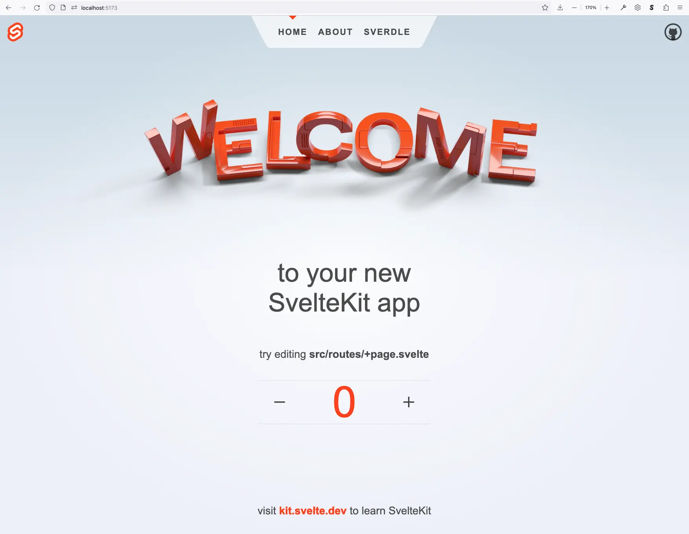
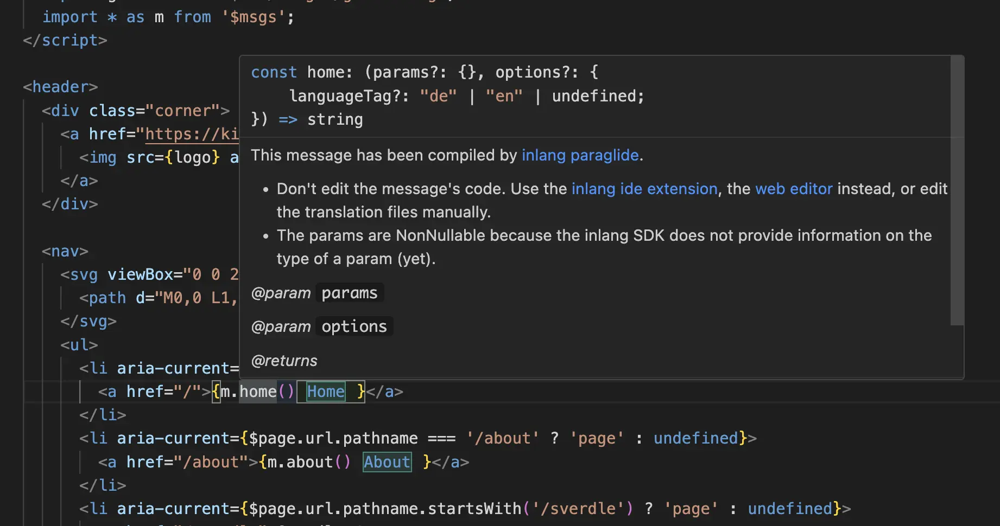
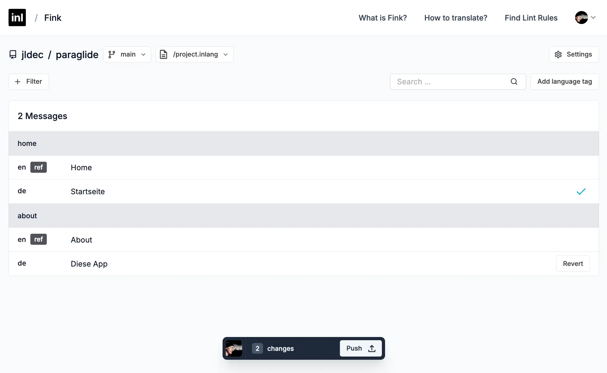
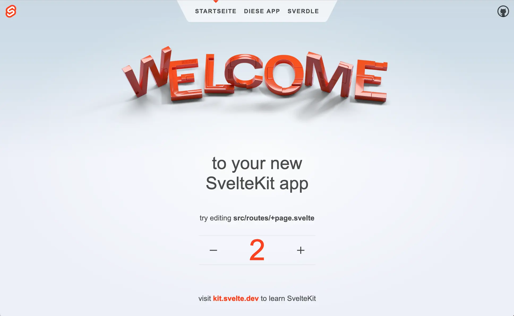

# i18n with inlang

Last week I had the [pleasure](the-web-is-for-everyone.md) of being at the Svelte Society London gettogether. The evening started with a talk about i18n by [@loris_sigrist](https://twitter.com/loris_sigrist) from [inlang](https://inlang.com/).

I was impressed by the story of [paraglide-js](https://inlang.com/m/gerre34r/library-inlang-paraglideJs) which compiles translatable strings into tree-shakable javascript functions. This can improve both the developer experience, with IntelliSense, and the user experience, with reduced bundle sizes.

In this post I cover:
  1. Trying out paraglide-js with the SvelteKit demo app.
  2. Extracting strings using the inlang VS Code extension.
  3. Translating messages in the browser using Fink.
  4. Making the translated messages appear in the SvelteKit demo app.

All the code and commits are in [https://github.com/jldec/paraglide](https://github.com/jldec/paraglide).

## Create a new SvelteKit demo app

```sh
pnpm create svelte@latest paraglide

cd paraglide
pnpm install
git init && git add -A && git commit -m init
pnpm dev
```



## Add paraglide-js
I followed the inlang [docs](https://inlang.com/m/gerre34r/library-inlang-paraglideJs#getting-started) to run paraglide `init`.

The CLI detected my uncommited changes and offered me a chance to exit before continuing.
```sh
pnpx @inlang/paraglide-js@latest init

 ╭─────────────────────────────────────╮
 │                                     │
 │  Welcome to inlang Paraglide-JS 🪂  │
 │                                     │
 ╰─────────────────────────────────────╯

ℹ You have uncommitted changes.

Please commit your changes before initializing inlang Paraglide-JS. Committing outstanding 
changes ensures that you don't lose any work, and see the changes the paraglide-js init 
command introduces.

✔ Do you want to initialize inlang Paraglide-JS without committing your current changes?
Yes

ℹ Creating a new inlang project in the current working directory.
✔ Successfully created a new inlang project.
✔ Added @inlang/paraglide-js to the devDependencies in package.json.
✔ Successfully added the compile command to the build step in package.json.
✔ Are you using VSCode?
Yes

✔ Added the inlang vs code extension to the workspace recommendations.

 ╭──────────────────────────────────────────────────────────────────────────────────────╮
 │                                                                                      │
 │  inlang Paraglide-JS has been set up sucessfully.                                    │
 │                                                                                      │
 │  1. Run your install command (npm i, yarn install, etc)                              │
 │  2. Run the build script (npm run build, or similar.)                                │
 │  3. Done :) Happy paragliding 🪂                                                     │
 │                                                                                      │
 │   For questions and feedback, visit https://github.com/inlang/monorepo/discussions.  │
 │                                                                                      │
 │                                                                                      │
 ╰──────────────────────────────────────────────────────────────────────────────────────╯
```

I then ran the suggested install and build.
```sh
pnpm install
pnpm build
git add -A
git commit -m 'Add paraglide'
```

And pushed the commit to a new repo on GitHub.
```sh
git remote add origin https://github.com/jldec/paraglide.git
git push
```

The [commit](https://github.com/jldec/paraglide/commit/548a1a85b13435d93bde99368148dd417f77b50c) shows that `@inlang/paraglide-js@latest init` added paraglide to `package.json`, and created `project.inlang/settings.json`.

## Extract strings with the inlang VS Code extension
When I opened the project in VS Code, I noticed the recommended [inlang VS Code extension](https://inlang.com/m/r7kp499g/app-inlang-ideExtension).

Once this was installed, I used 'Inlang: extract message' in the command palette, to extract "Home" and "About" from `src/routes/Header.svelte` into `/messages/en.json`.

```html
<li aria-current={$page.url.pathname === '/' ? 'page' : undefined}>
  <a href="/">{m.home()}</a>
</li>
<li aria-current={$page.url.pathname === '/about' ? 'page' : undefined}>
  <a href="/about">{m.about()}</a>
</li>
```

**/messages/en.json**
```json
{
  "$schema": "https://inlang.com/schema/inlang-message-format",
	"home": "Home",
	"about": "About"
}
```

Once things are configured properly, the extension will show IntelliSense and translated text for each `m.<key>()`.



I also had to add an import for the `m` namespace, using a `$msgs` alias which I created in `svelte.config.js`.

```js
import * as m from '$msgs';
```

```js
kit: {
  alias: {
    '$msgs': 'src/paraglide/messages.js'
  },
}
```

## Translation with the Fink editor
Fink makes it easy for translators to work with message files in a git repo, without having to clone the repo or use the git CLI directly.

You can specify the repo in the URL or using the input field at [https://fink.inlang.com/](https://fink.inlang.com/). Once authenticated and connected to the repo, inlang will rememer your recent projects in the dashboard.

I found the English messages as extracted, and added `de` German translations using Fink.



Fink then pushed a [commit](https://github.com/jldec/paraglide/commit/98b1b618a4d0badb56bde98bd9a6ec9acd03706a) to the repo in GitHub.

When I pulled down the changes, the new German messages were in `/messages/de.json`.

**/messages/de.json**
```json
{
	"$schema": "https://inlang.com/schema/inlang-message-format",
	"home": "Startseite",
	"about": "Diese App"
}
```

## Show translated messages in the SvelteKit demo app

To re-render the page Header when the language changes, I hacked Counter.svelte, to call `setLanguageTag()` whenever the count toggles beteween odd and even.

> [!tip]
> Normally users would change the language URL themselves, or it can be detected from the [browser](https://developer.mozilla.org/en-US/docs/Web/API/Navigator/language).

```ts
import { setLanguageTag } from '../paraglide/runtime';

let count = 0;
$: setLanguageTag(count % 2 ? 'en' : 'de');
```

I also added a reactive Svelte store called `$lang` in `src/lib/lang.ts`.

```ts
import { readable } from 'svelte/store';
import { onSetLanguageTag, languageTag } from '../paraglide/runtime';

export const lang = readable<string>('en', (set) => {
  onSetLanguageTag(set);
});
```

The value of the store is used as the key to the re-render the Header in `+layout.svelte`.

```html
<script>
	import Header from './Header.svelte';
	import './styles.css';
	import { lang } from '$lib/lang';
</script>

<div class="app">
{#key $lang}
	<Header />
{/key}
```

And the result looks like this:



The repo `https://github.com/jldec/paraglide` is public, so anyone can try it.


