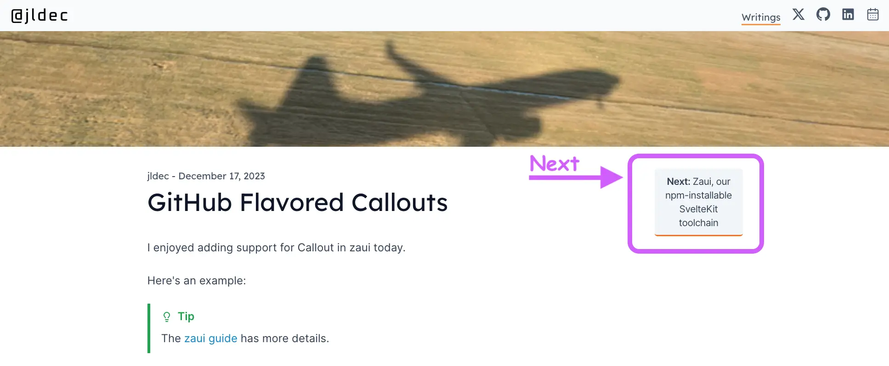

# GitHub Flavored Callouts

I enjoyed adding support for callouts in zaui today.

Here's an example:

> [!TIP]
> The [zaui guide](https://zaui.zeroasic.com/guide/markdown-extensions) has more details.

And here's the markdown source,

```md
> [!TIP]
> The [zaui guide](https://zaui.zeroasic.com/guide/markdown-extensions) has more details.
```

The markdown format matches the recently introduced GitHub Markdown [Alerts extension](https://github.blog/changelog/2023-12-14-new-markdown-extension-alerts-provide-distinctive-styling-for-significant-content/).

In addition to the now GitHub standard [!`NOTE`|`TIP`|`IMPORTANT`|`CAUTION`|`WARNING`] you can also follow the [!`{something}`] pattern, to make up your own callouts, perhaps with an emoji.

> [!💥 zaui]
> Getting a little better every day

## Next

Along with this change, zaui also gained a **next** button in the Post layout.

This should make it easier to navigate to the next page in the guide, and to the next post in the blog.

You can try it out at the top of this page...

