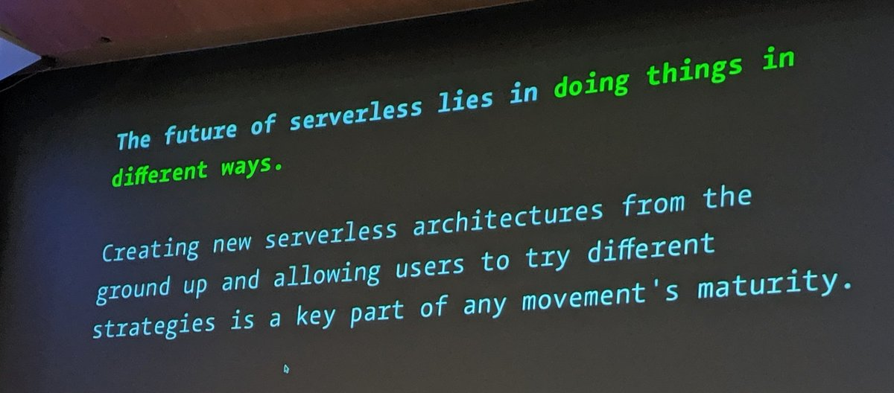

# Why Serverless at the Edge?

One of the more memorable moments from today's [#ServerlessDays](https://twitter.com/ServerlessLDN) event in London was [@monkchips](https://twitter.com/monkchips)' rather emphatic pronouncement of skepticism about Serverless at the edge.

It happened right before the Keynote which was all about WebAssembly, and for which running at the edge is an important use case.

Several speakers went on to make a strong case for technologies like WASM and WASI. 

This one by Cloudflare's own [@nodebotanist](https://twitter.com/nodebotanist), was the most profound.  

> But what makes Serverless at the edge useful in ways that more-centralized services are not?

## The edge is a trust boundary

I think it's helpful to understand the edge as the boundary where the wild Internet first touches something with a DNS name and an SSL certificate. 

This boundary is where, as a first order of business, we have a chance to protect Web properties from intruders and DDOS attacks ... a capability which remains Cloudflare's raison d'être today.

> Shouldn't this trust boundary be available to everyone?

Providing public websites with protection is a valuable service, but what if we could do something similar (at the edge) to provide regular people with the means to communicate and collaborate in private.

Sharing photos with friends and relatives should be as simple as choosing a DNS name, and installing software that you trust at the edge where your DNS name meets the Internet. 

This software will give you control over who gets to see your photos, and your relatives will be able to visit without surveillance or ads.

Photos are just one example. Sharing documents, sharing code, sharing work ... communicating privately is fundamental to our lives and to our economy.

> Serverless at the edge has the potential to make the Web great again, for all of us.  
>
> 🌎

